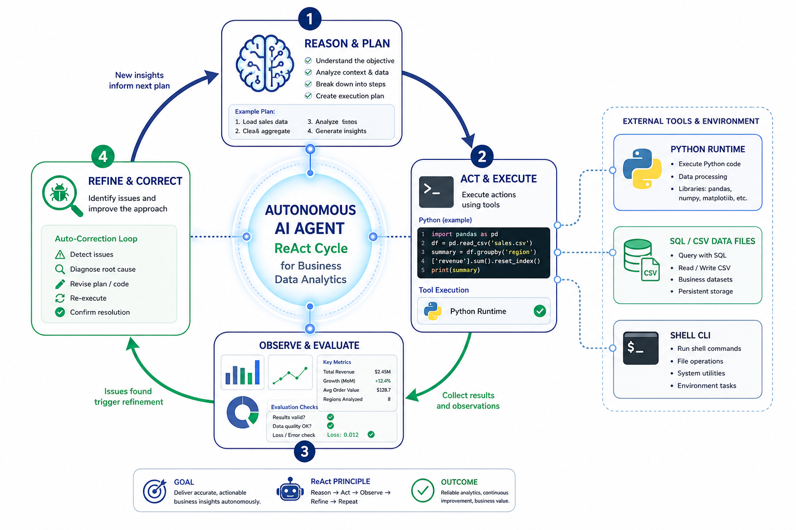
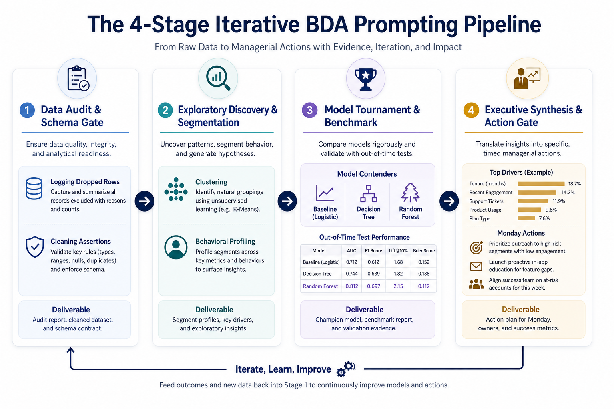
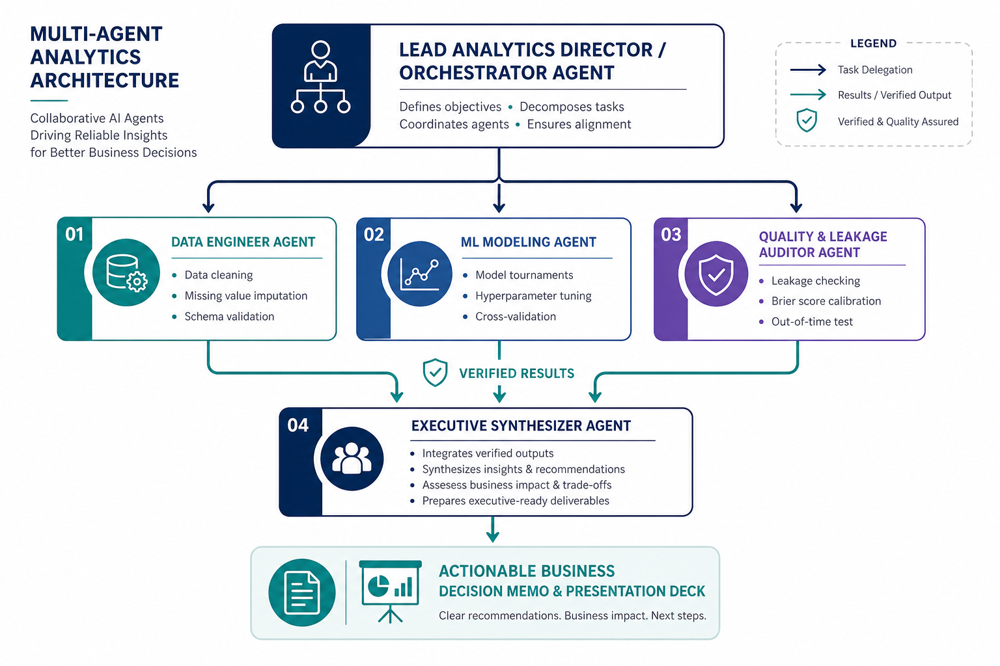

<!-- _class: lead -->
<!-- _header: "" -->
<!-- _footer: "" -->
<!-- _paginate: "" -->

  Executive Technical Masterclass
  <h1 style="font-size: 40px; margin-bottom: 10px; color: #1e3a8a;">Harnessing LLM Agents for Business Data Analytics with Python</h1>
  

    From Passive Prompting to Autonomous Multi-Agent Analytical Pipelines
  

  

    <strong>Applied Business Analytics Course</strong> · Turning Real Datasets into Audited Commercial Value
  

---

## 1. Executive Roadmap: The Agentic BDA Paradigm

  

    
Foundation Ecosystem & Prompting

    <ul style="margin-bottom: 0;">
      <li><strong>IDE vs. CLI:</strong> Interactive exploration vs. headless execution pipelines.</li>
      <li><strong>Anatomy of a Prompt:</strong> The 4-pillar blueprint for rigorous analytical queries.</li>
      <li><strong>Iterative Prompting:</strong> Leading agents sequentially across milestones.</li>
    </ul>
  

  

    
Execution Strategy & Synthesis

    <ul style="margin-bottom: 0;">
      <li><strong>Plan Before Coding:</strong> Spec-driven design in Plan Mode to stop errors.</li>
      <li><strong>Model Tournaments:</strong> Forcing baseline benchmarks & test calibration.</li>
      <li><strong>Executive Synthesis:</strong> Bridging statistical models to managerial action.</li>
    </ul>
  

  💡 <strong>Core Principle:</strong> You are not a code typist; you are the <strong>Lead Analytics Director</strong> orchestrating intelligent agents to deliver audited business decisions.

---

## 2. Paradigm Shift: From Chatbots to Autonomous Agents

  

    
Traditional LLM Chatbot

    

      Text In → Text Out (Passive)
    

    <ul style="font-size: 17px; margin-bottom: 0;">
      <li>Only generates code snippets in isolation.</li>
      <li>Cannot read local CSVs or inspect errors.</li>
      <li>Relies on user to copy-paste, debug, and execute.</li>
      <li>Prone to hallucinating columns and library APIs.</li>
    </ul>
  

  

    
  

  <code>[User Query]</code> → <strong>Reason & Plan</strong> → <strong>Act (Tool Execution)</strong> → <strong>Observe (Metrics/Errors)</strong> → <strong>Refine & Deliver</strong>

---

## 3. Agentic Ecosystem: IDE vs. CLI Environments

  

    
Agentic IDE Interactive & Visual

    
<strong>Core Tools:</strong> <a href="https://www.cursor.com/" target="_blank">Cursor</a> · <a href="https://codeium.com/windsurf" target="_blank">Windsurf</a> · <a href="https://code.visualstudio.com/docs/copilot/overview" target="_blank">VS Code Copilot Agent</a> · <a href="https://kiro.dev/ide/" target="_blank">Kiro</a>

    <ul style="font-size: 16px; margin-bottom: 0;">
      <li><strong>Inline Diffs & Review:</strong> Inspect every code modification visually.</li>
      <li><strong>Immediate Plot Rendering:</strong> Direct display of Matplotlib/Seaborn.</li>
      <li><strong>Notebook First:</strong> In-place editing of <code>.ipynb</code> cells and markdown.</li>
      <li><em>Best for:</em> Exploratory Data Analysis, debugging, slide decks.</li>
    </ul>
  

  

    
Agentic CLI Headless & Terminal

    
<strong>Core Tools:</strong> <a href="https://docs.anthropic.com/en/docs/agents-and-tools/claude-code/overview" target="_blank">Claude Code</a> · <a href="https://aider.chat/" target="_blank">Aider</a> · <a href="https://github.com/features/copilot/cli" target="_blank">GitHub Copilot CLI</a> · <a href="https://opencode.ai/docs/cli/" target="_blank">opencode</a>

    <ul style="font-size: 16px; margin-bottom: 0;">
      <li><strong>Deep Workspace Search:</strong> Blazing-fast ripgrep indexing across repos.</li>
      <li><strong>Batch Pipeline Execution:</strong> Run automated scripts, tests, and sweeps.</li>
      <li><strong>Git & CI Automation:</strong> Autonomous branching, committing, and scoring.</li>
      <li><em>Best for:</em> Data pipeline construction, grid searches, scoring.</li>
    </ul>
  

  🎯 <strong>Workflow Synergy:</strong> Use <strong>Agentic CLI</strong> for batch data processing and model sweeps; switch to <strong>Agentic IDE</strong> to inspect charts, iterate notebooks, and craft executive decks.

---

## 4. When to Use Which Tool: Comparison Matrix

| Analytical Stage | Agentic IDE (<a href="https://www.cursor.com/">Cursor</a> / <a href="https://codeium.com/windsurf">Windsurf</a>) | Agentic CLI (<a href="https://docs.anthropic.com/en/docs/agents-and-tools/claude-code/overview">Claude Code</a> / <a href="https://aider.chat/">Aider</a>) | Recommended Workflow |
| :--- | :--- | :--- | :--- |
| **1. Data Audit & Cleaning** | Inspect sample tables, visualize missingness | Batch execution of outlier scripts & schema checks | <strong>CLI</strong> for batch runs, <strong>IDE</strong> for sanity checks |
| **2. Feature Engineering** | Interactive <code>.ipynb</code> transform experimentation | High-speed script generation & unit testing | <strong>IDE</strong> for visual verification of distributions |
| **3. Model Tournaments** | View confusion matrices & ROC curves | Run long-running grid searches & cross-validation | <strong>CLI</strong> (background runs with progress monitoring) |
| **4. Diagnostic Refinement** | Side-by-side code diffs & manual tweaking | Rapid refactoring across multiple <code>.py</code> modules | <strong>IDE</strong> for precise visual code review |
| **5. Executive Deliverable** | Formatting Marp slides, Jupyter RISE decks | Automated report generation & data bundling | <strong>IDE</strong> for aesthetic slide and table polish |

  <em>Professional data teams combine both: CLI provides computational torque; IDE provides human oversight.</em>

---

## 5. Anatomy of a High-Impact BDA Prompt

  
The 4-Pillar Analytics Prompt Blueprint

  

    

      <strong>1. Persona & Context</strong> 
      "Senior Hospitality Revenue Economist working on hotel booking cancellations."
    

    

      <strong>2. Concrete Business Objective</strong> 
      "Segment booking types to recommend differentiated deposit and reminder policies."
    

    

      <strong>3. Technical Boundaries & Schema</strong> 
      "Use pandas/sklearn. Features: <code>lead_time</code>, <code>adr</code>, <code>market_segment</code>. No target leakage!"
    

    

      <strong>4. Verification & Output Schema</strong> 
      "Evaluate via 5-fold TimeSeriesSplit ROC-AUC. Produce a summary comparison table."
    

  

  

    ❌ <strong>Vague Prompt:</strong> "Analyze this hotel dataset and build a model to predict cancellations with Python."
  

  

    ✅ <strong>Engineered Prompt:</strong> Defines persona, business stakes, exact column roles, CV scheme, and table format.
  

---

## 6. Practical Prompt Comparison 1: Data Cleaning & Hygiene

  

    
Bad Prompt Lazy & Ambiguous

    

"Clean the dataset in inn_hotels_train.csv and remove bad rows."
    

    

      <strong>Catastrophic Consequence:</strong> The agent uses <code>df.dropna()</code> or silently removes 60% of valid rows with zero prices, destroying promotional stay segments with zero logging.
    

  

  

    
Good Prompt Audited & Constrained

    

"Audit inn_hotels_train.csv. Log dropped counts for:
1. Invalid calendar dates (e.g. Feb 29 non-leap).
2. Zero total nights (weekend+weekday == 0).
3. avg_price_per_room == 0 ONLY IF market_segment != 'Complementary'.
4. Exact feature duplicates (ignoring row_id).
Print a pandas Series summarizing rows dropped per rule and total kept."
    

    

      <strong>Result:</strong> Produces a verifiable audit trail showing 28,445 → 20,153 records with explicit commercial justification.
    

  

---

## 7. Practical Prompt Comparison 2: Feature Engineering & Leakage

  

    
Bad Prompt Unchecked & Leaky

    

"Create new features from all columns in the hotel table to predict booking_status."
    

    

      <strong>Catastrophic Consequence:</strong> Agent includes post-arrival fields (e.g. <code>reservation_status_date</code> or checkout status), achieving 99.9% fake accuracy that collapses in production.
    

  

  

    
Good Prompt Temporal & Leak-Proof

    

"Engineer features strictly available at booking creation:
- lead_time_log = np.log1p(lead_time)
- total_party_size = no_of_adults + no_of_children
- is_family = (no_of_children > 0).astype(int)
Strict Rule: Do NOT include booking_status or any post-booking signals. Wrap numeric transforms in sklearn Pipeline to avoid scaling leakage."
    

    

      <strong>Result:</strong> Clean, leak-free feature matrix mathematically sound for out-of-time inference.
    

  

---

## 8. Practical Prompt Comparison 3: ML Model Tournaments

  

    
Bad Prompt The Single Fit Fallacy

    

"Train a machine learning classifier on the data and print the accuracy score."
    

    

      <strong>Consequence:</strong> Agent fits an unregularized Decision Tree on the full dataset without a holdout split. Accuracy = 98%, but it cannot generalize to next season.
    

  

  

    
Good Prompt The Model Tournament

    

"Conduct a 3-contender model tournament on train:
1. Baseline: DummyClassifier(strategy='prior')
2. Interpretable: DecisionTreeClassifier(max_depth=5)
3. Ensemble: RandomForestClassifier(n_estimators=200, max_depth=12)
Split: Use Aug-Sep 2018 as mini-holdout.
Metrics: Output Markdown table with ROC-AUC, Avg Precision, Recall@10%, and Brier Score."
    

    

      <strong>Result:</strong> Clear empirical proof of generalization (Dummy AUC 0.50 → Tree 0.89 → Forest 0.90).
    

  

---

## 9. How to Develop & Evolve Great Prompts

  

    
Step 1 Ground in Reality

    <ul style="font-size: 15px; margin-bottom: 0;">
      <li>Feed exact table schemas, data types, and head rows to the agent.</li>
      <li>Never let the agent guess column names or categorical levels.</li>
      <li>Quote business pain points and operational constraints directly.</li>
    </ul>
  

  

    
Step 2 Restrict Toolspace

    <ul style="font-size: 15px; margin-bottom: 0;">
      <li>Specify allowed libraries (e.g. <code>scikit-learn</code>, <code>statsmodels</code>).</li>
      <li>Forbid unrequested heavy dependencies (e.g., PyTorch for tabular).</li>
      <li>Enforce random seeds for strict reproducibility (<code>random_state=42</code>).</li>
    </ul>
  

  

    
Step 3 System Rules File

    <ul style="font-size: 15px; margin-bottom: 0;">
      <li>Store project rules in <code>.cursor/rules/</code> or <code>CLAUDE.md</code>.</li>
      <li>Set coding standards: <em>"English only"</em>, <em>"Short diffs"</em>, <em>"No emojis"</em>.</li>
      <li>Loaded automatically on every agent invocation without re-typing.</li>
    </ul>
  

  ⚙️ <strong>Prompt Engineering as Code:</strong> Version control your prompts and rules alongside your Python codebase.

---

## 10. Interactive Pipeline Leadership (4-Stage Pipeline)

  

    
  

  

    
Pipeline Discipline Stop Waterfalling!

    <ul style="font-size: 16px;">
      <li><strong>Gate 1 (Audit):</strong> Inspect cleaning log. Never train on unverified data.</li>
      <li><strong>Gate 2 (EDA):</strong> Review segment profiles (lead time, ADR, special requests).</li>
      <li><strong>Gate 3 (Model):</strong> Verify out-of-time test AUC and Brier calibration score.</li>
      <li><strong>Gate 4 (Action):</strong> Require segment-specific Monday morning decisions.</li>
    </ul>
    

      🛡️ <em>If an error occurs at Gate 1, halt and correct before touching Gate 2.</em>
    

  

---

## 11. Designing a Plan Before Implementation (Plan Mode)

  

    
The Hazard The Blind Coding Trap

    
When prompted to code immediately, LLMs jump into syntax, write 200 lines of brittle pandas transformations, hallucinate columns, and introduce fatal target leakage.

    

      ⚠️ <em>A small error in the wrong place is a silent business catastrophe.</em>
    

  

  

    
The Protocol The 3-Step Spec Protocol

    <ol style="font-size: 16px; margin-bottom: 0;">
      <li><strong>Read-Only Exploration:</strong> Inspect dataset shapes, datatypes, and missingness without writing code.</li>
      <li><strong>Structured Plan Creation:</strong> Detail the pipeline DAG, data split logic, feature definitions, and metrics.</li>
      <li><strong>Human Gate & Approval:</strong> You review the blueprint, adjust assumptions, and authorize execution.</li>
    </ol>
  

  🛡️ <strong>Plan Mode in Practice:</strong> Switch the agent into <code>Plan Mode</code> in Cursor / Claude Code to lock the design before generating a single line of production code.

---

## 12. Requiring Agents to Summarize Key Business Insights

  

    
The "So What?" Principle

Executives do not purchase model coefficients, ROC curves, or $R^{2}$ scores. They purchase **risk mitigation and profit growth**.

    

      <em>"Our model has an AUC of 0.88 with lead_time importance at 0.35."</em> 
      → <strong>So what?</strong> 
      <em>"Guests booking >90 days out cancel at 58%, representing €420k in dark rooms. We must enforce 30-day non-refundable deposits on OTA channels."</em>
    

  

  

    
The 4-Part Insight Prompting Schema

    <ul style="font-size: 15px; margin-bottom: 0;">
      <li><strong>1. Finding:</strong> Concrete statistical fact with numbers.</li>
      <li><strong>2. Mechanism:</strong> Operational root cause behind the data.</li>
      <li><strong>3. Commercial Impact:</strong> Quantified revenue or cost risk.</li>
      <li><strong>4. Monday Action:</strong> Specific operational change with a named owner (Front Desk / Revenue Management).</li>
    </ul>
  

---

## 13. Translating Statistical Metrics into Commercial Impact

| Statistical Metric | What the LLM Sees | How to Prompt for Executive Translation | Resulting Business Insight |
| :--- | :--- | :--- | :--- |
| **Feature Importance (lead_time = 0.38)** | Gini impurity split frequency | *"Translate lead_time importance into booking window risk tiers with cancellation percentages."* | "Bookings made $\ge 90$ days out have a 58% cancellation rate vs. 19% for $\lt 20$ days." |
| **Interaction (special_requests $\times$ lead_time)** | Tree split depth interaction | *"Cross-tabulate cancellation rate by lead_time quartiles across special request counts."* | "Guests requesting $\ge 2$ special services cancel at $\lt 3\%$ even at 200 days lead time." |
| **Top-Decile Recall (Recall@10% = 25%)** | Ranked precision metric | *"Calculate the financial recovery if front desk calls the top 10% highest-risk bookings."* | "Focusing confirmation calls on the top 10% risky bookings protects 25% of all cancellations." |
| **Brier Score Loss (0.139)** | Mean squared probability error | *"Explain why well-calibrated probabilities prevent guest walk compensation costs."* | "Accurate probabilities allow precise overbooking limits without walking loyal corporate guests." |

  <em>Never accept raw scikit-learn output without mandating commercial translation.</em>

---

## 14. Practical Prompt Comparison 4: Summarizing Insights

  

    
Bad Prompt Passive Summary

    

"Summarize the results of the model for management."
    

    

      <strong>Generic LLM Output:</strong> <em>"The Random Forest model performed well with an accuracy of 88%. Lead time, ADR, and special requests were important features. Management should use this model to predict cancellations."</em> (Zero business value!).
    

  

  

    
Good Prompt Executive Action Memo

    

"Act as Lead Revenue Consultant. Write a 1-page General Manager Memo:
1. Core Commercial Finding: Quantify cancel rate across Q1 segments.
2. Exploratory Surprise: Highlight the special requests vs lead time effect.
3. Monday Morning Action Matrix:
   - High-risk Online Leisure: Deposit & overbooking policy.
   - Low-risk Corporate: Frictionless VIP treatment.
4. Strategic Limitations: Note why autumn test drift requires quarterly re-calibration."
    

    

      <strong>Result:</strong> Actionable boardroom memo with quantified operational rules.
    

  

---

## 15. Multi-Agent Architecture: Collaborative Specialization

  

    
  

  

    
Specialized Roles Isolation = Quality

    <ul style="font-size: 15px;">
      <li><strong>Orchestrator:</strong> Deconstructs RFP and manages the DAG.</li>
      <li><strong>Data Engineer:</strong> Cleans raw table & outputs immutable Parquet.</li>
      <li><strong>ML Specialist:</strong> Conducts benchmark tournaments on training set.</li>
      <li><strong>Quality Auditor:</strong> Adversarial check on data leakage & Brier score.</li>
      <li><strong>Executive Synthesizer:</strong> Prepares boardroom slide deck & memo.</li>
    </ul>
    

      💡 <em>Specialization prevents context window poisoning and ensures independent auditing.</em>
    

  

---

## 16. Case Study: End-to-End Hotel Cancellation Analytics

  

    
Phase 1 Segmentation (Q1)

    
<strong>Prompt:</strong> <em>"Perform PCA and K-Means on scaled behavioral features (lead time, ADR, special requests). Profile each segment's cancellation rate without using the target label in clustering."</em>

    

      <strong>Result:</strong> Discovers 4 distinct archetypes (e.g., <em>Long-lead OTA leisure</em> vs. <em>Short-lead Corporate</em>).
    

  

  

    
Phase 2 Predictive Policy (Q2)

    
<strong>Prompt:</strong> <em>"Train Random Forest on pre-October arrivals. Evaluate on post-October test arrivals using ROC-AUC. Connect Q1 clusters to specific deposit policies."</em>

    

      <strong>Result:</strong> ROC-AUC 0.88; prescribes strict 30-day deposits for OTA leisure while keeping corporate bookings friction-free.
    

  

🏆 **Real-World Impact:** The agent uncovers that guests with $\ge 2$ special requests cancel at $\lt 3\%$ even at 200+ days lead time, preventing unnecessary reminder spam.

---

## 17. Critical Pitfalls & How to Neutralize Them

  

    
1. Target & Temporal Leakage

    <ul style="font-size: 15px;">
      <li><strong>Trap:</strong> Scaling before splitting, or using post-event signals (e.g. <code>reservation_status_date</code>).</li>
      <li><strong>Fix:</strong> Enforce <code>sklearn.pipeline.Pipeline</code> and temporal train/test cuts.</li>
    </ul>
  

  

    
2. Blind Acceptance of AI Code

    <ul style="font-size: 15px;">
      <li><strong>Trap:</strong> Agent outputs plausible-looking code that silently drops 80% of rows.</li>
      <li><strong>Fix:</strong> Always demand before/after row count assertions and distribution prints.</li>
    </ul>
  

  

    
3. Context Window Poisoning

    <ul style="font-size: 15px;">
      <li><strong>Trap:</strong> Dumping huge raw CSV texts into chat, exceeding token limits.</li>
      <li><strong>Fix:</strong> Force agent to use file-inspection tools (e.g. <code>head -n 5</code>, <code>df.info()</code>).</li>
    </ul>
  

  

    
4. Metric Hallucination

    <ul style="font-size: 15px;">
      <li><strong>Trap:</strong> Agent claims "Model achieved 94% accuracy" on imbalanced 90/10 data.</li>
      <li><strong>Fix:</strong> Require baseline dummy score, Precision-Recall AUC, and confusion matrix.</li>
    </ul>
  

---

## 18. The 5 Golden Rules for the AI-Augmented Analyst

  

    <strong>1. Ground in Real Data:</strong> Never let an agent operate on hypothetical schema; provide audited schemas and head rows.
  

  

    <strong>2. Plan Before Code:</strong> Enforce a written specification in Plan Mode and human approval before code execution.
  

  

    <strong>3. Stage Milestone Gates:</strong> Lead sequentially: Audit → EDA/Segmentation → Modeling → Executive Story.
  

  

    <strong>4. Test Every Claim:</strong> Require automated baseline comparisons, cross-validation, and out-of-time test scores.
  

  

    <strong>5. Demand the "So What?":</strong> Translate statistical outputs into dollar impact and specific Monday morning actions.
  

---

<!-- _class: lead -->
<!-- _header: "" -->
<!-- _footer: "" -->
<!-- _paginate: "" -->

  <h1 style="font-size: 38px; color: #1e3a8a; margin-bottom: 12px;">Summary & Classroom Hands-On Lab</h1>
  

    "The best data analysts do not write every line of code by hand. They design the strategy, steer the agents, and audit the results."
  

  

    <strong style="color: #1e3a8a;">Today's Classroom Mission:</strong>
    <ol style="margin-top: 6px; margin-bottom: 0; font-size: 17px;">
      <li>Open your Agentic IDE (<a href="https://www.cursor.com/">Cursor</a>) or CLI (<a href="https://docs.anthropic.com/en/docs/agents-and-tools/claude-code/overview">Claude Code</a>) on the Hotel dataset.</li>
      <li>Draft a 4-pillar specification prompt in Plan Mode.</li>
      <li>Execute the 4-stage pipeline: Clean → Segment → Model → Action Memo.</li>
      <li>Submit your audited <code>submission.csv</code> and 1-page Executive Memo.</li>
    </ol>
  

